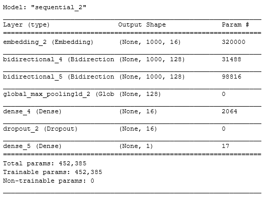
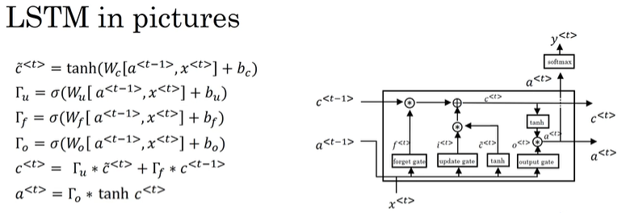
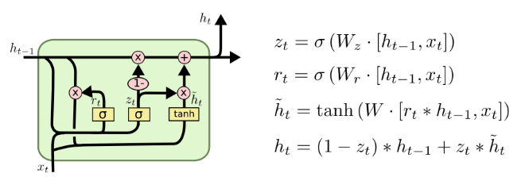
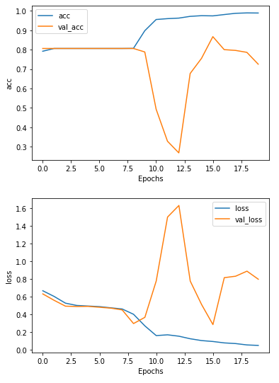
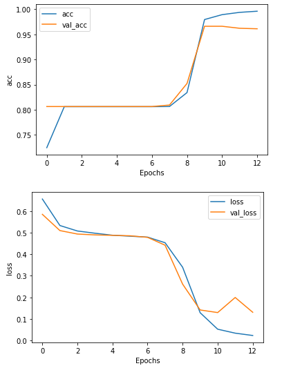
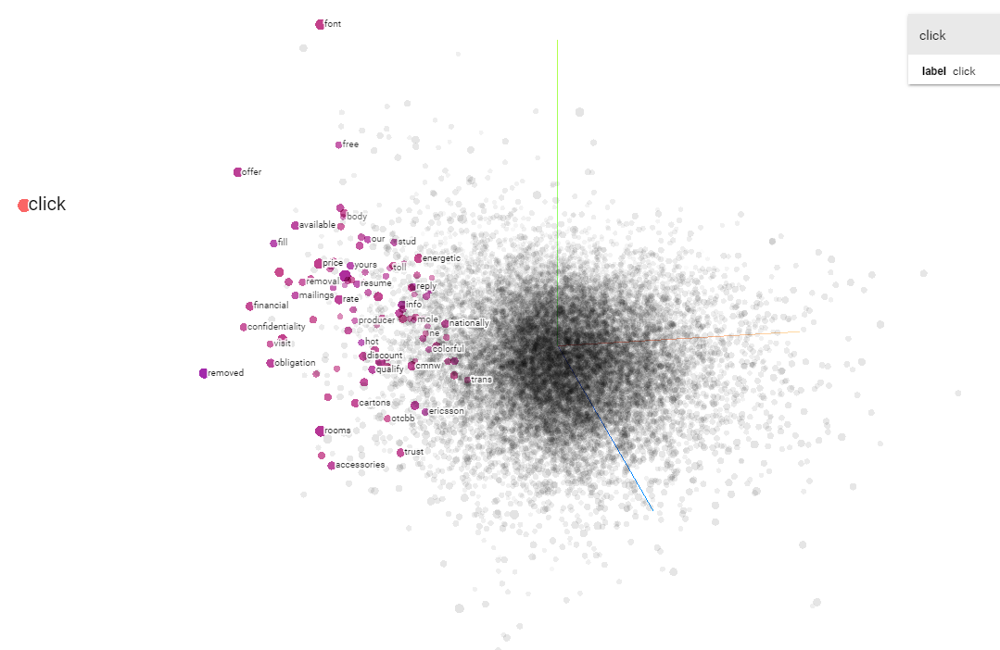
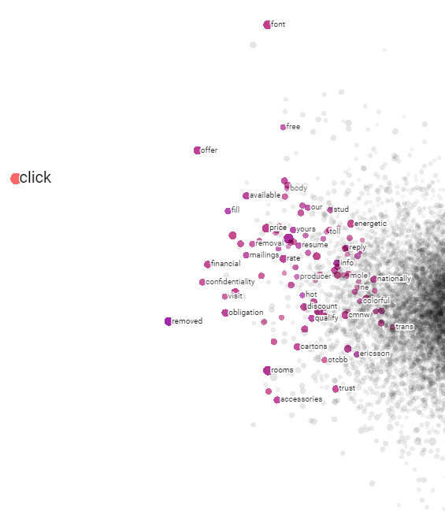
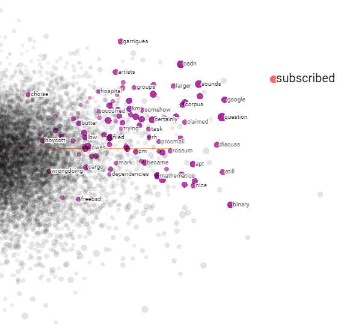

# Spam-Email-Detector

## Problem Description:
Spam email is also known as Junk email. Since the early 1990, the number of spam emails had grown steadily. According to CYREN, by 2014, there were approximately 54 billion spam emails sent out everyday. The emails content are various, such as pharmaceutical products, job offering, diet products, and other advertisements.[2] 

In our daily life, when we are reading through a mailbox, people spend a lot of time determining whether an email is spam or non-spam. Most spam emails are for commercial or advertising purposes, but some spam emails can be dangerous. Those spam emails often contain the links that lead to some malicious websites or have some sophisticated malware code embedded in the attachment, which could cause the leakage of sensitive information.

For example, by January 2004, Sophos reported that Facebook had won a $873 million dollar judgement against a Canadian man who bombarded millions of Facebook members with unsolicited spam messages. The spammer tricked users to reveal their passwords and usernames and then used those information to gain access to their personal profiles. Facebook claimed that this man had sent out more than four million messages promoting products from marijuana to sexual enhancement drugs.[1]

## Methodology:
In this project, our goal is to design a spam email detector, which is able to tell whether a given email is spam or ham(non-spam). The overall process for designing a spam email detector is simple. Generally can be described in five procedures, Extracting the dataset, Processing the dataset, Splitting dataset to training, validation and testing groups, Tokenize the word corpus, and Design deep learning architecture. I will briefly go through the main idea for each procedure, and shed some light on the underlying techniques that I applied for the learning model.

- Part1: Related Email Message Protocol:
  - SMTP is a pushing protocol which can be used to deliver messages from a user agent to the mail server, as well as the communication between mail servers.
  - POP3, IMAP, and HTTP are known as mail access protocols that allow user agents to obtain the message from mail servers to local devices, and the most popular protocol is IMAP, which allows users to manage the messages stored in remote servers, and other features, such as allowing user agent to obtain part of a multipart MIME messages.[7]
- Part2: Extracting the dataset
  - The data was provided by Apache SpamAssassin, and it has two categories: spam and ham(non-spam). [3]  The original dataset was archived with tar and then compressed with bzip2 with .tar.bz2 extension. With Unix utility -- tar, we can uncompress the file with commands like tar xvjf 20030228_easy_ham_2.tar.bz2. Now the file is accessible, we can start to aggregate the file path to two categories, one for spam and another for non-spam. The email was constructed in MIME format, which is an internet standard for email message communication. With the help of email build-in module in python, we can extract the text body from email. The email was constituted by many content types, such as Header Line(SUBJECT, FROM, TO), Content-Type, and Content-Disposition. In order to get the body of the message, we use the .get_payload() method, which will return the body content in str type.
- Part3: Data Processing
  - The content of a raw message consists of various features, such as Hyperlink, characters, digits, emails, date etc. In order to reduce the overhead of the training process and the size of word corpus, I applied several data cleaning processes: 1) decapitalize all characters. 2) Remove any digits, email, hyperlink, CRLF(Carriage Return and Line Feeder) and Header information. 3) Remove stopwords -- common words like ‘the’, ‘a’, ‘you’, that have no particular meaning for making decisions.
  - After some cleaning processes, we see the text is much cleaner without those whitespaces and special characters, and it is also simpler to feed to the Tokenizer. 
- Part4: Data Splitting
  - The data was separated into three groups: 0.7 proportion for Training, 0.2 proportion for Validation and 0.1 proportion for Testing. Particularly, the training dataset was used for training the classifier, and validation dataset is used to evaluate the training performance after each epoch and helping us to improve the model, and the testing dataset is ultimately used to examine the model performance. As always a good practise, the testing dataset should never be touched until we decide the model is satisfiable. 
- Part5: Tokenization
  - The common way for encoding the text is using ASCII(American Standard Code for Information Interchange), but the problem with that is the semantic of words and the orders are not encoded, so it can be a heavy burden task for training a neural network. Tokenizer is a text tokenization utility class that is embedded within tensorflow.keras.preprocessing.text namespace. It did a lot of heavy lifting tasks for us, such as converting text into a stream of tokens, removing the punctuation like space and comma, and uniforming the sequence to have the same length. With the help of Tokenizer, we can encode our text sentence into a stream of sequences and feed it into a neural network.
- Part6: Model Design
  - The learning architecture that I designed for training this spam email detector is pretty simple, which can be described in the order of following layers: Embedding layer with 16 embedding dimension, Bidirectional GRU, Bidirectional LSTM, Global Max Pooling, Dense layer with 16 neurons and Relu as activation functions, Dropout layer, and finally a Dense layer with single neuron and sigmoid activation functions. All this can be simply visualized by the following sequential model summary:
  
  - Beside the overall structure, there are couple techniques I think it’s worth to point out:
    - Word Embedding: People spend a lot of half a century figuring out a successful way to represent words and keep their semantics meaningful. The most popular and promising way to represent those words is called word embedding. A word embedding is mapped each word to a vector representation where words that have the similar meaning should have a closer relationship in a predefined vector space. (Note the number of features is much smaller than the size of vocabulary. It a dense distributed representation contrast to the sparse representation with one-hot encoding)[5]
    - LSTM: The basic RNN model is simple. However, It only allows us to look at the recent information to perform current tasks and have trouble in making connections to any further context. The primary reason that LSTM became so popular and important to use is because it provides the solution to this Long-Term Dependencies problem, which allows earlier words to be carried to later one via a cell state, and here is the structure of LSTM block in the figure below:[6]
    
    - GRU: GRU(Gated Recurrent Unit) is a variance of LSTM. It merges the “forget gate” and “input gater” into a single “update gate”, which makes it simpler than the original version of LSTM, and here is the structure of GRU block in the figure below: [6]
    
    - Sigmoid: Quoted from Cola’s own words: “The sigmoid layer outputs numbers between zero and one, describing how much of each component should be let through. A value of zero means “let nothing through,” while a value of one means “let everything through!” “ [6]
    - Dropout layer: Dropout is a regularization technique to reduce the Overfitting problem. The idea of dropout is to randomly discard the number of neurons in a network layer. The dropout rate usually was set between 0 and 1, which indicates percent of neurons to drop. The larger the dropout rate the larger the number of neurons will be discarded. 

## Result:
- The Baseline model:
With 20 epochs of training, we notice as the training accuracy increases the validation accuracy starts falling down, and it’s an obvious sign of Overfitting. To solve this problem, there are some other techniques that I tried for the improved model: 1) Use the dropout after the final Dense layer. 2) Use the Bidirectional LSTM layer. 

- The Baseline model:
With 20 epochs of training, we notice as the training accuracy increases the validation accuracy starts falling down, and it’s an obvious sign of Overfitting. To solve this problem, there are some other techniques that I tried for the improved model: 1) Use the dropout after the final Dense layer. 2) Use the Bidirectional LSTM layer. 

- Visualization in TensorFlow Projector:
Embedding is the idea of representing texts as vectors in a vector space, here is the vector space of our model showing in the figure below. The original embedding dimension that I initialized was 16, however after being compressed with the PCA algorithm we are able to see it in a 3D simulated space. There are many other visualization methods we could try as well, such as t-SNE and UMAP.

Looking at the Figures, the Embedding word vector space shows the location of words like “click”, “free”, “offer” and “fill” are clustering together moving to the left, so we can infer that there is a higher chance of seeing those words in a spam email.

Similarly, Looking at the right side of Embedding vector space, the words that clustering at the right are more likely being drawn from non-spam email, and they indeed have more positive meaning than previous and feeling less suspicious.

## Future work:
There are also a couple methods that are worth trying if we want to get a better performance for the spam email detector. Firstly, we could try to tune our hyperparameter, such as size of word corpus, embedding dimension, regularization methods, optimizer etc. Second, we could try some word-level pre-trained model, such as Word2Vec and Glove, and use that to fine-tune the model. Third, beside the word-level embedding, we could also use the character-level embedding, and there are several pre-train character-level models available to try, such as ELMo, and Flair embedding.

## Summary:
The project shows a remarkable result of what humans can achieve with modern technology. The spam filtering detector definitely provides us an extra layer of protection to our sensitive information and privacy from being trapped by the malicious hyperlink or content, especially to those young age children who are full of curiosity about the internet. Under the help of NLP techniques, now the job of filtering spam email can be handed over to machines, and the whole process can be done in a much shorter amount of time than we are doing this manually.

Also, we saw that the Bidirectional LSTM model showed a significant improvement than the baseline model. It not only prevents overfitting but also improves the accuracy of the learning model. Of Course, this is just a basic model, and there are a lot of things we can do to improve it, to make it more robust and efficient to train. 

## Reference:
1.	Sophos, Spammers defy Bill Gates's death-of-spam prophecy and get creative with social networking in Q4 2008, January 2009, https://www.sophos.com/en-us/press-office/press-releases/2009/01/dirty-dozen.aspx. Accessed 26 July. 2020
2.	“Internet Threats Trend Report”, Cyren, April 2014, https://www.cyberoam.com/downloads/ThreatReports/CyberoamCYRENInternetThreats2014April.pdf. Accessed 26 July. 2020
3.	Apache SpamAssassin, https://spamassassin.apache.org/old/publiccorpus/, Accessed 26 July. 2020
4.	Gan, Sie Huai, Spam Filtering System With Deep Learning, Feb 22, 2019, https://towardsdatascience.com/spam-filtering-system-with-deep-learning-b8070b28f9e0. Accessed 26 July. 2020
5.	Jurafsky, Daniel, H. Martin, James, Speech and Language Processing, Oct 2, 2019, https://web.stanford.edu/~jurafsky/slp3/6.pdf. Accessed 26 July. 2020
6.	Olah, Christopher, Understanding LSTM Networks, August 27, 2015, https://colah.github.io/posts/2015-08-Understanding-LSTMs/. Accessed 26 July. 2020
7.	Ross, Keith W, Kurose, James F. Computer Networking: A Top-Down Approach. 7th ed., Pearson, 2017.
